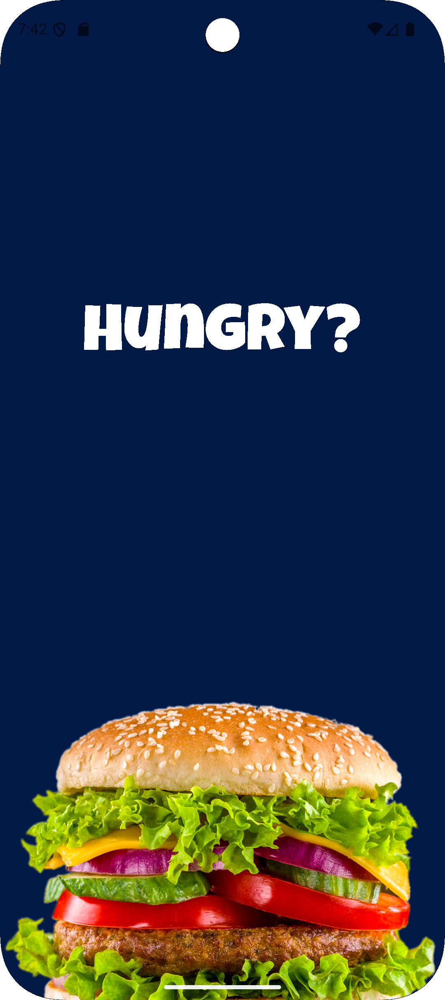
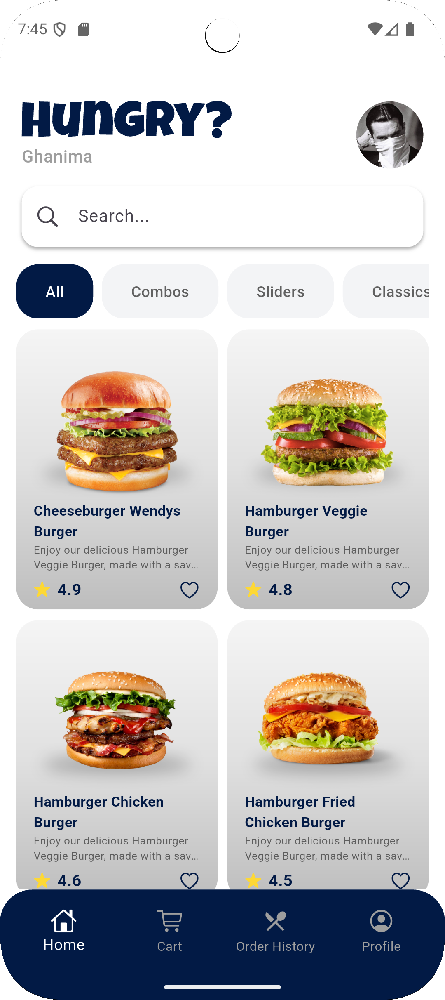
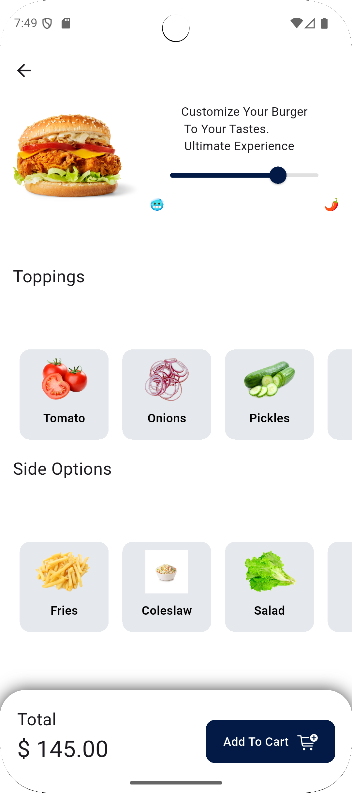
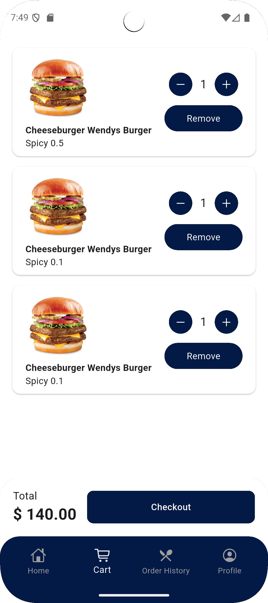
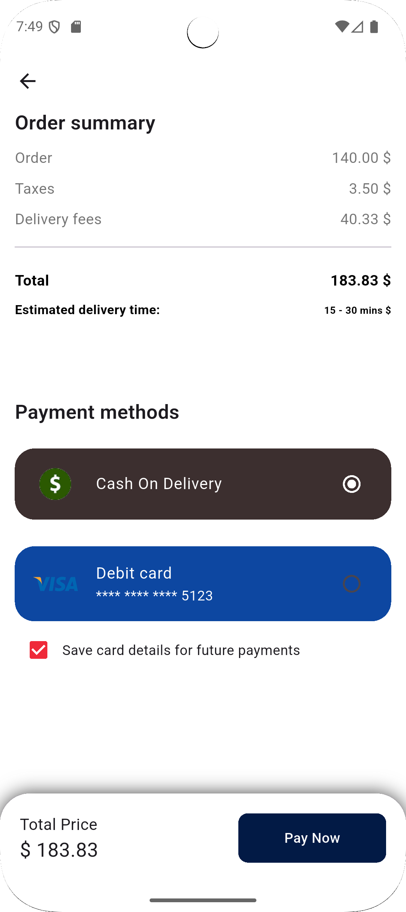
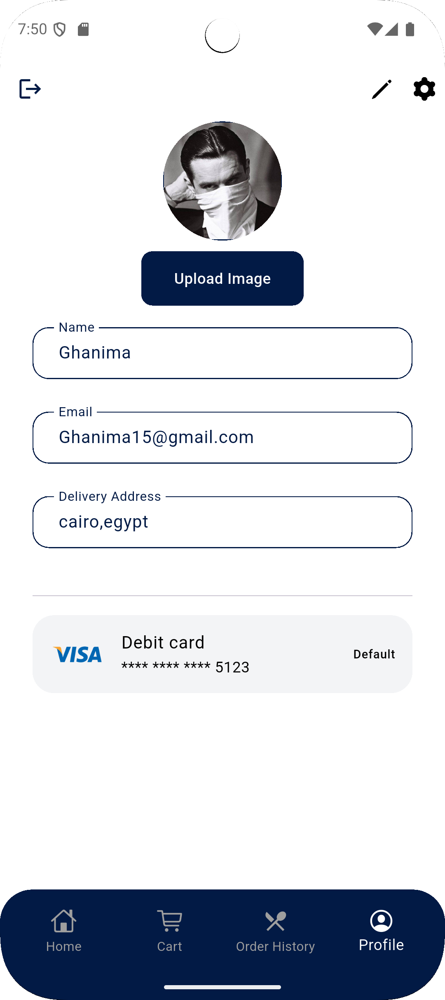

  

# Hungry App 🍔
Food Ordering Mobile Application built with Flutter

Hungry App is a modern food ordering mobile application built with Flutter that allows users to browse meals, manage their cart, and complete checkout with a clean and responsive UI.

---

## 🚀 Features
- User Authentication
- Browse Restaurants & Meals
- Product Details
- Cart & Checkout
- Profile Management
- REST API Integration
- Responsive UI (Android & iOS)

---

## 🛠️ Tech Stack
- Flutter & Dart
- REST APIs
- MVC / Clean Architecture
- State Management
- Custom UI Components

---

## 📱 App Screenshots

  
  
  

  
  

---

## 📦 Project Structure
lib/
├── core
├── features
├── shared
├── main.dart

---

## 👨‍💻 Author
**Abdelrahman Ghanima**  
Flutter Mobile Application Developer

---

## ⭐ Show Your Support
If you like this project, give it a ⭐ on GitHub!
